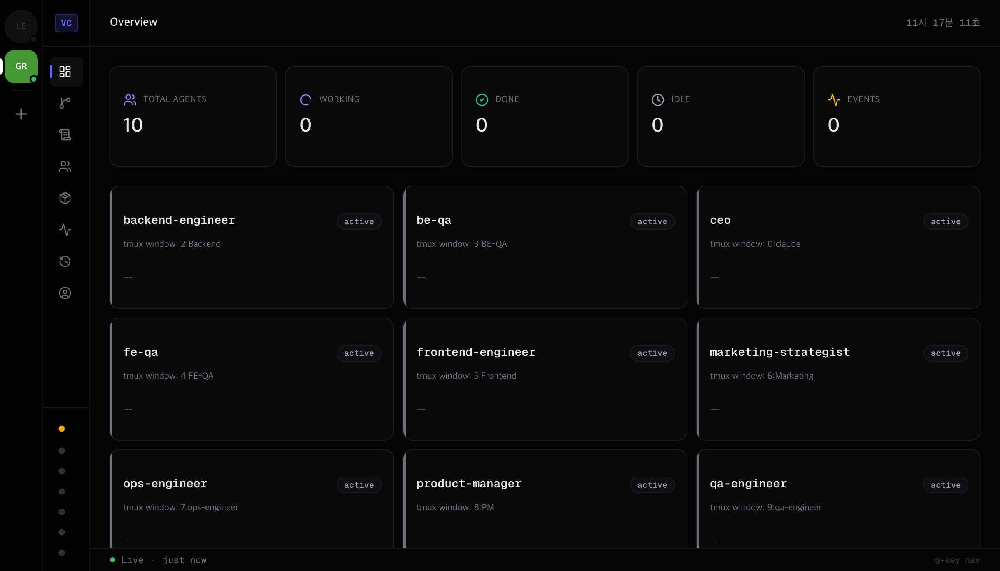
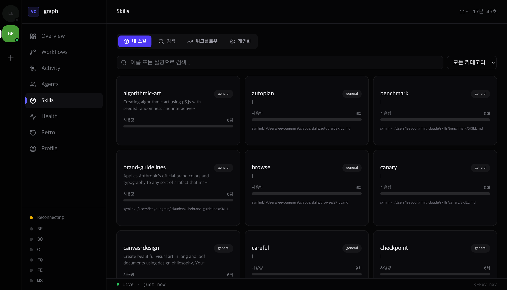
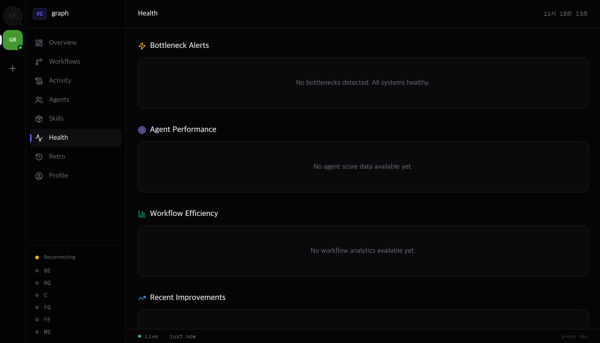
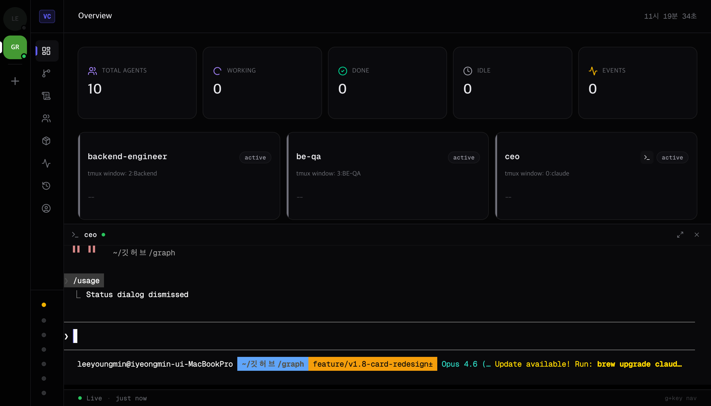
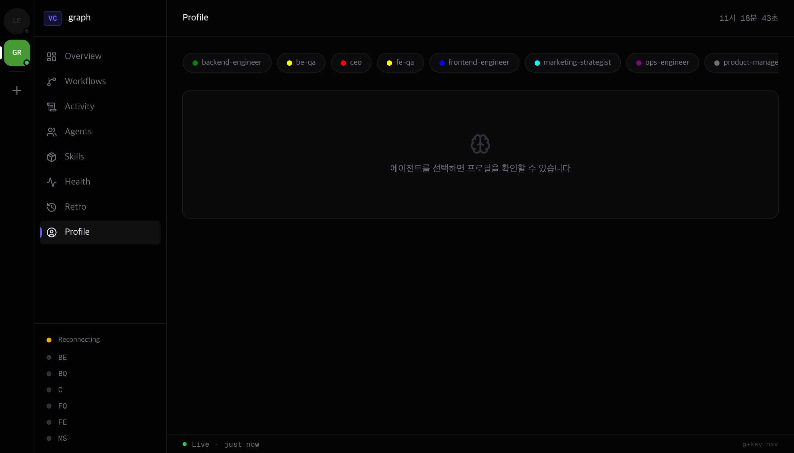

<div align="center">

# make-company

### The self-improving multi-agent system built on Claude Code

One command turns Claude Code into an 8-person AI team that plans, builds, tests, and learns from every task.

```bash
claude -company
> "Build a todo app"
# CEO delegates -> PM writes PRD -> Designer + Backend work in parallel -> Frontend builds -> QA verifies
```

[](https://opensource.org/licenses/MIT)
[](https://docs.anthropic.com/en/docs/claude-code)
[](https://www.python.org/)
[](https://github.com/E0min/make-company/releases)

</div>

---

<p align="center">
  
</p>

## Table of Contents

- [What is make-company?](#what-is-make-company)
- [Features](#features)
- [Quick Start](#quick-start)
- [Dashboard](#dashboard)
- [Two Modes](#two-modes)
- [Agents](#agents)
- [Intelligence System](#intelligence-system)
- [Skills](#skills)
- [Web Terminal](#web-terminal)
- [Harness Engineering](#harness-engineering)
- [Commands](#commands)
- [Existing Project Migration](#existing-project-migration)
- [Architecture](#architecture)
- [Troubleshooting](#troubleshooting)
- [Contributing](#contributing)
- [License](#license)

---

## What is make-company?

Claude Code is one brilliant developer. `make-company` is that developer leading a full team of specialists.

```
You: "Build a todo app"

  CEO     -> analyzes, delegates
  PM      -> writes PRD
  Designer -+
  Backend  -+ work in parallel
  Frontend <- takes both outputs, builds
  QA      -> tests everything
```

Each agent runs as an independent `claude --agent` session in its own tmux window. Talk to any of them directly, or let the CEO orchestrate everything.

### Why make-company?

| | Claude Code | make-company |
|---|---|---|
| **Roles** | One general-purpose AI | CEO, PM, Designer, FE, BE, QA, Marketing -- **7 specialist roles** |
| **Command** | You direct every step | Say "build a todo app" -- **CEO delegates automatically** |
| **Pipeline** | Single context does everything | PM writes PRD -> Designer specs -> **FE implements -> QA verifies** |
| **Parallelism** | Sequential execution | Designer + Backend **run simultaneously** |
| **Quality** | You review manually | **FE-QA + BE-QA auto-verify** and file bug reports |
| **Learning** | Resets after each session | Agents **accumulate memory** across sessions |
| **Workflows** | None | YAML pipelines with **dependency resolution** |
| **Monitoring** | Terminal output only | **Web dashboard** (real-time SSE) + tmux + web terminal |
| **Self-improvement** | Not possible | System detects bottlenecks and **evolves autonomously** |

---

## Features

- **8 Specialist Agents** -- CEO, PM, Designer, Frontend, Backend, FE-QA, BE-QA, Marketing
- **Two Orchestration Modes** -- CEO autonomous mode (`/company run`) + YAML pipeline mode (`/company workflow`)
- **Web Dashboard** -- Next.js + shadcn/ui with real-time monitoring, multi-project support
- **Web Terminal** -- xterm.js v6 with direct keyboard input, full-width responsive, ANSI color support
- **Agent Memory** -- Structured learnings, patterns, and self-assessment that persist across sessions
- **Shared Knowledge** -- Cross-agent learning (what QA discovers informs the engineer next time)
- **Performance Analytics** -- Agent scoring, workflow bottleneck detection, trend analysis
- **Skill Management** -- 50+ skills browseable, per-agent assignment, usage tracking, personalization
- **Self-Improvement Loop** -- Retrospectives generate action items that feed back into agent behavior
- **Multi-Project** -- Discord-style project switching, run multiple companies simultaneously
- **Zero Dependencies** -- Python stdlib server serves both API and static dashboard (no Node.js at runtime)
- **Harness Engineering** -- Code-enforced guardrails: auto-logging, session boot sequence, output validation, drift detection
- **Auto-Upgrade** -- gstack-style version checking across all projects

---

## Quick Start

### 1. Clone & Install

```bash
git clone https://github.com/E0min/make-company.git ~/make-company

# Install agents, workflows, and skill
mkdir -p ~/.claude/agents ~/.claude/workflows ~/.claude/skills/company
cp ~/make-company/template/agents-v2/*.md ~/.claude/agents/
cp ~/make-company/template/workflows/*.yml ~/.claude/workflows/
cp ~/make-company/template/skill/skill.md ~/.claude/skills/company/

# Register the launcher
cat >> ~/.zshrc << 'ZSHRC'
export VC_TEMPLATE="$HOME/make-company"
claude() {
  if [[ "$1" == "-company" || "$1" == "--company" ]]; then
    shift; bash "$VC_TEMPLATE/vc-launch.sh" "$@"
  else
    command claude "$@"
  fi
}
ZSHRC
source ~/.zshrc
```

### 2. Start

```bash
cd ~/your-project
claude -company
```

First run shows agent selection:

```
Virtual Company v2.1
Project: my-project

Available agents:
  1. CEO / Orchestrator (required)
  2. Product Manager
  3. UI/UX Designer
  4. Frontend Engineer
  5. Backend Engineer
  6. Frontend QA
  7. Backend QA
  8. Marketing Strategist

Select agents (e.g., 1,2,4,5 or all):
```

### 3. Use

**CEO mode** (window 0):
```
/company run Build a todo app with priorities and filters
```

**Direct agent chat** (switch windows):
```
Ctrl+B -> 4    # Go to Frontend window
> Make this component responsive
```

**YAML workflow**:
```
/company workflow new-feature "Add search functionality"
```

### Prerequisites

| Tool | Min Version | Install |
|------|-------------|---------|
| macOS / Linux | macOS 12+ / Ubuntu 20+ | -- |
| Python 3 | 3.8+ | `brew install python3` |
| tmux | 3.0+ | `brew install tmux` |
| Claude Code CLI | 2.1+ | `npm install -g @anthropic-ai/claude-code` |
| Node.js | 18+ | Required for Claude Code CLI |

---

## Dashboard

```
/company dashboard
```

Auto-finds an open port and launches the web dashboard.

<p align="center">
  
</p>

### Tabs

| Tab | Description |
|-----|-------------|
| **Overview** | KPI cards (total/working/done/idle), agent status grid with terminal buttons |
| **Workflows** | React Flow visual workflow builder + natural language generation + execution |
| **Activity** | Real-time SSE activity log |
| **Agents** | Agent CRUD, AI generation, color picker, global import |
| **Skills** | 50+ skills browseable, search, workflow builder, per-agent customization |
| **Health** | Bottleneck alerts, agent performance scores, workflow efficiency analysis |
| **Retro** | Retrospective timeline, team shared knowledge base |
| **Profile** | Per-agent memory viewer, performance metrics, tool profiles |

<p align="center">
  
</p>

### Multi-Project

One dashboard, multiple projects. Discord-style project bar on the left:

- Green dot = active (tmux session running)
- Gray dot = offline
- Start/Stop from the dashboard
- Click to switch projects instantly

<p align="center">
  
</p>

---

## Web Terminal

Click any agent's terminal button to open a full terminal in the browser.

<p align="center">
  
</p>

- **Direct keyboard input** -- type directly into the terminal, just like a native terminal
- **Full-width responsive** -- tmux pane auto-resizes to match browser width
- **ANSI color support** -- Powerline glyphs, Claude Code TUI, everything renders correctly
- **Scrollback preserved** -- close and reopen, your history is still there
- **Canvas renderer** -- xterm.js v6 with hardware-accelerated Canvas addon

---

## Two Modes

### CEO Mode -- `/company run <task>`

The main Claude acts as CEO and autonomously orchestrates the team.

```
/company run "Build a music recommendation SaaS from planning to implementation"
```

```
Main Claude (CEO mode)
  |-> PM: write PRD          (Agent tool)
  |     -> PRD returned
  |-> Designer + Backend     (parallel Agent tool calls)
  |     |-> Design spec returned
  |     |-> API design returned
  |-> Frontend: implement    (receives both outputs)
  |     -> Code returned
  |-> QA: verify
  |     -> Issue report returned
```

CEO decides dynamically:
- New feature -> PM first
- UI change -> Designer directly
- Bug fix -> QA first
- Independent tasks -> parallel dispatch

### Workflow Mode -- `/company workflow <name> [input]`

YAML pipelines execute in defined order with dependency resolution.

```yaml
name: new-feature
steps:
  - id: spec
    agent: product-manager
    prompt: "{{input}} requirements"
  - id: design
    agent: ui-ux-designer
    prompt: "{{steps.spec.output}} based design"
    depends_on: [spec]
  - id: code
    agent: frontend-engineer
    prompt: "{{steps.design.output}} implement"
    depends_on: [design]
```

Built-in workflows: `new-feature`, `bug-fix`, `design-only`, `marketing-launch`

---

## Agents

| ID | Role | Responsibility |
|----|------|----------------|
| `ceo` | CEO / Orchestrator | Task analysis, team delegation, parallel/sequential decisions |
| `product-manager` | Product Manager | Discovery, PRD, Features, IA, User Flow |
| `ui-ux-designer` | UI/UX Designer | Wireframes, design system, component specs |
| `frontend-engineer` | Frontend Engineer | Design spec -> code implementation |
| `backend-engineer` | Backend Engineer | API/DB design and implementation |
| `fe-qa` | Frontend QA | UI/UX/accessibility/responsive verification |
| `be-qa` | Backend QA | API contract/integration/performance/security verification |
| `marketing-strategist` | Marketing Strategist | Positioning/messaging/channel strategy/copy |

Agents are defined as `.md` files in `~/.claude/agents/` (global) or `.claude/agents/` (project). Each agent receives project context and accumulated memory at runtime.

---

## Intelligence System

<p align="center">
  
</p>

### Agent Memory

Each agent accumulates structured knowledge across sessions:

```markdown
## Learnings
- [2026-04-09] Validate API contracts before handoff (confidence:8, source:retro-001)

## Patterns
- Next.js static export + Python server: same-origin API, no NEXT_PUBLIC needed

## Self-Assessment
- Avg quality: 7.2/10 (last 5 tasks)
- Strengths: API contract compliance, type definitions
- Weaknesses: Empty state handling (3/5 tasks)
```

### Shared Knowledge

Cross-agent learning -- what FE-QA discovers is available to Frontend Engineer next time:

```json
{"author":"fe-qa", "type":"pitfall", "key":"xss-escape",
 "insight":"Apply escapeHtml to all dynamic content",
 "confidence":9, "relevant_agents":["frontend-engineer","backend-engineer"]}
```

### Performance Analytics

- **Agent scoring**: tasks completed, quality trend, error rate, duration
- **Workflow bottleneck detection**: identifies slowest steps, suggests parallelization
- **Self-improvement loop**: retrospectives generate action items -> agent memory -> behavior improves

### Tool Profiles

Prompt-based per-agent tool management (since Claude Code MCP is global, not per-agent):

```json
{
  "frontend-engineer": {
    "preferred": ["Read", "Write", "Edit", "Bash", "chrome-devtools"],
    "avoid": ["WebSearch"],
    "instructions": "Use chrome-devtools MCP for browser testing"
  }
}
```

---

## Skills

The dashboard includes a skill management hub with 50+ skills:

- **My Skills** -- browse installed skills, search by name/category, view usage stats
- **Find Skills** -- discover local and community skills (`clawhub search`)
- **Skill Workflows** -- compose skills into visual pipelines
- **Customization** -- per-project overrides, per-agent config, learning-based recommendations

Skill usage is tracked per agent per task, enabling the system to recommend skills based on past success rates.

---

## Harness Engineering

Prompts are guides. Harnesses are guarantees.

A prompt says "log this to JSONL." A harness **makes it happen** whether the model follows instructions or not. Based on patterns from [Anthropic](https://www.anthropic.com/engineering/effective-harnesses-for-long-running-agents) and [Phil Schmid](https://www.philschmid.de/agent-harness-2026).

### Three Harness Layers

```
Prompt Layer (skill.md)        -- Guide (CEO is expected to follow)
     |
Code Layer (hooks)             -- Enforced (100% execution guaranteed)
     |  |-- agent-harness.sh   -- Auto JSONL logging on every Agent tool call
     |  |-- session-boot.sh    -- State restoration + health check on session start
     |  |-- auto-retro.sh      -- Retrospective reminder if CEO forgets
     |
Server Layer (server.py)       -- Validation + Analytics (API)
     |-- harness/health        -- Environment health score (0-100)
     |-- harness/progress      -- Auto-generated progress summary
     |-- harness/checklist     -- Incomplete task detection
     |-- harness/drift         -- Model drift detection (50+ events)
     |-- harness/validate      -- Agent output quality gate
```

### Hooks (Code-Enforced)

| Hook | Trigger | What it does |
|------|---------|-------------|
| `agent-harness.sh` | PostToolUse | Auto-logs Agent calls to JSONL, tracks file changes, suggests checkpoints every 10 edits, detects destructive commands |
| `session-boot.sh` | UserPromptSubmit | On `/company run`: restores last session state, injects retro action items, shows health score, auto-creates missing directories |
| `auto-retro.sh` | PostToolUse | Detects task_end without retro_saved, reminds CEO to run retrospective |

### Server APIs (Validation + Analytics)

| Endpoint | What it does |
|----------|-------------|
| `GET harness/health` | 7-point environment check: tmux, config, agents, dirs, memory, retros. Returns 0-100 score |
| `GET harness/progress` | Auto-generates progress summary from activity.jsonl (Anthropic's claude-progress.txt pattern) |
| `GET harness/checklist` | Finds started-but-incomplete tasks + completed-without-retro tasks |
| `GET harness/drift` | Detects agent behavior changes: 50%+ duration increase or 20%+ quality decline |
| `POST harness/validate` | Output quality gate: rejects too-short output, detects error patterns, flags unresolved TODOs |

### Why Not Just Prompts?

```
Prompt: "Please log JSONL after each agent call"
  -> Model busy? Skipped. Context full? Forgotten. New session? Lost.

Harness: PostToolUse hook runs on every Agent tool call
  -> Always executes. No exceptions. Data guaranteed.
```

---

## Commands

| Command | Description |
|---------|-------------|
| `claude -company` | Start tmux session (agent selection + all windows) |
| `/company setup` | Agent selection + project configuration |
| `/company run <task>` | Multi-agent (CEO autonomous mode) |
| `/company workflow <name> [input]` | Sub-agent (YAML pipeline) |
| `/company dashboard` | Web dashboard (auto port + browser open) |
| `/company memory [agent-id]` | View/edit agent memory |
| `/company retro` | Retrospective list/analysis |
| `/company upgrade` | Upgrade to latest version |

### Keyboard Shortcuts (tmux)

| Key | Action |
|-----|--------|
| `Ctrl+B -> 0~8` | Switch windows |
| `Ctrl+B -> d` | Detach (session persists) |
| `claude -company` | Re-attach |
| `Ctrl+B -> &` | Close current window |

---

## Existing Project Migration

Already have `.claude/agents/` with custom agents? `/company setup` auto-detects and offers v2 migration:

```
Existing agents detected:
  data-engineer.md       -- v2 compatible (placeholders found)
  my-custom-agent.md     -- migration needed (no placeholders)

Upgrade existing agents to v2 format? (y/n)
```

Migration adds two placeholders without modifying existing content:

```markdown
## Project Context
{{project_context}}

## Accumulated Memory
{{agent_memory}}
```

Custom agents and global agents work side by side.

---

## Architecture

```
make-company/
├── vc-launch.sh                   # claude -company launcher
├── VERSION                        # Version (auto-upgrade check)
├── bin/
│   ├── vc-update-check            # gstack-style version check
│   ├── vc-upgrade                 # Upgrade script
│   └── vc-usage-monitor           # Context usage monitor
├── template/
│   ├── agents-v2/                 # 8 agent definitions (.md)
│   ├── workflows/                 # 4 YAML workflows
│   ├── skill/                     # /company skill definition
│   ├── dashboard/
│   │   └── server.py              # Python stdlib API server (zero deps)
│   ├── dashboard-next-v2/         # Next.js dashboard source
│   └── hooks/                    # Harness hooks (agent-harness, session-boot, auto-retro)
│       ├── app/                   # App Router
│       ├── components/dashboard/  # 12+ tab components
│       └── lib/                   # API client, types, utils
```

### Data Files (per project)

```
.claude/company/
├── config.json              # Project + agent configuration
├── activity.log             # Human-readable activity log
├── activity.jsonl           # Machine-readable structured events
├── shared-knowledge.jsonl   # Cross-agent learnings
├── agent-memory/            # Per-agent structured memory (.md)
├── agent-output/            # Per-agent output logs
├── retrospectives/          # Auto-generated retrospective JSONs
├── analytics/               # Computed scores, usage, trends
├── tool-profiles.json       # Per-agent tool preferences
├── skill-overrides.json     # Per-project skill customization
├── improvements/            # Self-improvement recommendations
└── dashboard/               # Server + static dashboard (out/)
```

### Tech Stack

- **Orchestration**: Claude Code Agent tool (native `subagent_type` mapping)
- **Sessions**: tmux (one window per agent)
- **Server**: Python 3 stdlib `ThreadingHTTPServer` (zero dependencies)
- **Dashboard**: Next.js 16 + shadcn/ui + React Flow + xterm.js v6 (static export)
- **Terminal**: xterm.js with Canvas addon, tmux pipe-pane + send-keys
- **Data**: File-based (JSONL for append, JSON for snapshots, Markdown for memory)

---

## Troubleshooting

<details>
<summary><code>claude</code> command not found</summary>

```bash
npm install -g @anthropic-ai/claude-code
```
</details>

<details>
<summary><code>tmux</code> command not found</summary>

```bash
brew install tmux          # macOS
sudo apt install tmux      # Ubuntu/Debian
```
</details>

<details>
<summary>Dashboard port conflict</summary>

```bash
lsof -ti:7777 | xargs kill   # Kill existing process
python3 .claude/company/dashboard/server.py 8080   # Use different port
```
</details>

<details>
<summary><code>/company</code> skill not recognized</summary>

```bash
ls ~/.claude/skills/company/skill.md
# If missing:
mkdir -p ~/.claude/skills/company
cp ~/make-company/template/skill/skill.md ~/.claude/skills/company/
```
</details>

<details>
<summary>Agent not responding</summary>

- Verify Claude Code login: run `claude`
- Check Anthropic API key or Claude Pro/Max subscription
- Check network connection
</details>

---

## Contributing

PRs welcome.

- **New agents**: Add `.md` files to `template/agents-v2/`
- **New workflows**: Add `.yml` files to `template/workflows/`
- **Dashboard UI**: See [DESIGN.md](DESIGN.md) -- dark-first, single indigo accent, Geist font

---

## License

MIT -- see [LICENSE](LICENSE).

---

<div align="center">

**v1**: tmux send-keys | **v2**: Claude Code Agent tool | **v2.1**: Intelligence + harness engineering

Built with Claude Code.

</div>
